# Thmanyah Real-Time Streaming Assignment

This project simulates a real-time data streaming system using Kafka, Debezium, Redis, BigQuery, and Faust. The architecture ingests user engagement events, enriches them with content metadata, and writes enriched data to Redis, BigQuery, and a mock external system.

---

## Architecture Overview

- **PostgreSQL** + **Debezium** → change data capture (CDC) for events.
- **Kafka** → message broker.
- **Faust** → real-time -less than 5 sec response- stream processing and enrichment (Also used Flink logic already added).
- **Redis** → fast storage for enrichment and aggregations.
- **Redis Insight** → Redis GUI client (for inspection).
- **BigQuery** → long-term storage and analytics.
- **Redpanda Console** → Kafka topic inspection (GUI).
- **pgAdmin** → PostgreSQL GUI client.

### High-Level Architecture

```sql
+------------------+     +----------------+     +------------------+     +----------------------------+
|   PostgreSQL     | --> |   Debezium     | --> | Apache Kafka     | --> |    Faust App (and Flink)   |
|  (source data)   |     | (CDC Source)   |     |  (Event Bus)     |     |     (Stream Processor)     |
+------------------+     +----------------+     +------------------+     +----------------------------+
                                                                                |        |        |
                                                                           BigQuery  Redis   External API
```

---

## Technologies Used

| Component        | Tool                                                                           |
|------------------|--------------------------------------------------------------------------------|
| Streaming Engine | **Faust** (Python-native, lightweight alternative to Flink for local dev)      |
| Source Connector | PostgreSQL CDC (via **Debezium**)                                              |
| Message Broker   | Apache Kafka (intermediate pub/sub layer)                                      |
| Sink Connectors  | BigQuery client, Redis client, HTTP client (mock external system)              |
| Infrastructure   | Docker Compose                                                                 |
| Data Generator   | Python script (to simulate engagement & content data into PostgreSQL)          |

## Features
- Real-time event ingestion via Kafka
- Enrichment with content metadata
- Track the changes in DB through Debezium for CDC 
- Backfill support for historical PostgreSQL data
- Redis scoring and n-minute engagement aggregation 
- RedisInsight integration support (manual)
- BigQuery loading
- Mock data generation and Dev-friendly tooling
- Clean modular codebase with `app/` structure
- Makefile for full setup automation

---

## Setup Instructions

### 1️⃣ Prerequisites

- [`pyenv`](https://github.com/pyenv/pyenv)
- Docker + Docker Compose
- Python 3.9.x (installed via `pyenv`)
- Google Cloud credentials (if using BigQuery)
- [`Redis Insight`](https://redis.io/insight/) (Optional)

### 2️⃣ Clone & Prepare

```bash
git clone https://github.com/your-org/thmanyah-streaming-assignment.git
cd thmanyah-streaming-assignment

cp .env.example .env     # Fill in your local values
```

### 3️⃣ Run All in One

Use the Makefile to set everything up and run the pipeline:

```bash
make
```

This will:

- Create a virtual environment
- Install dependencies
- Start all Docker services
- Wait for services to become healthy
- Register Debezium connector
- Run Faust streaming app
- Generate mock data


## Run Manually (Step-by-Step)

```bash
make setup               # Python venv setup
make up                  # Start Docker containers
make wait                # Wait for services (2 mins)
make register-connector  # Register Debezium
make run-faust           # Start Faust
make mock-data           # Run mock generator
```

## Utilities
```bash
make down                  # Stop all Docker containers and delete them 
make clean                 # Clean all containers, volumes
make backfill              # Backfill script for reproduce PostgreSQL data to kafka topic 
```

---

## Project Structure
```
├── app/.               <- Core logic
│   ├── config.py
│   ├── models.py
│   ├── faust_app.py
│   ├── enrichment.py
│   ├── redis_utils.py
│   └── bigquery_utils.py
├── config/             <- JSON configs (Debezium)
│   └── debezium-source.json
├── docker/             <- Docker compose + SQL init
│   ├── docker-compose.yml
│   └── init-db.sql
├── scripts/            <- Helper scripts (mock, setup, connector, etc.)
│   ├── setup.sh
│   ├── clean_and_run_faust.sh
│   ├── generate_mock_data.py
│   ├── run_mock_data.sh
│   ├── register_debezium_connector.py
│   └── backfill.py
├── .env.example        <- Environment variables
├── Makefile            <- Task runner
└── requirements.txt    <- Python deps
```

---

## Environment Variables

Define all variables in `.env` (see `.env.example` for a template):

- Kafka broker URL
- Redis config
- BigQuery project + credentials path
- PostgreSQL and pgAdmin settings
- External API mock URL

---

## Screenshots

Below are some screenshots demonstrating the project in action:

### Docker Running Services 
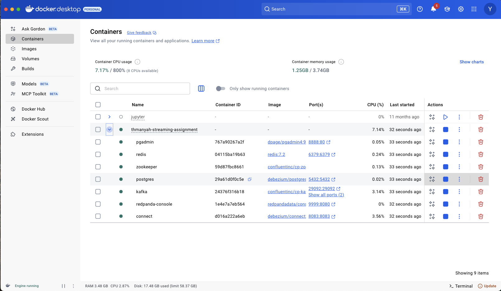

---

### Kafka Topics
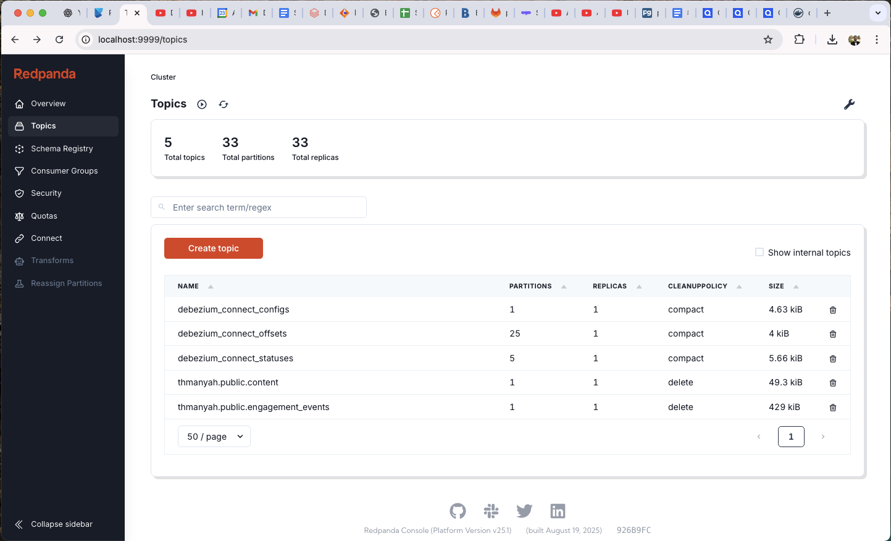

#### Kafka Topic: `engagement_events` 
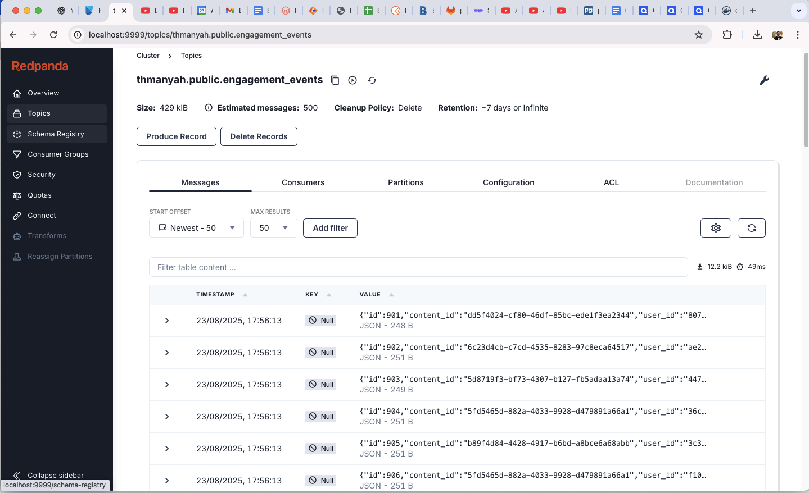
#### Kafka Topic: `content` 
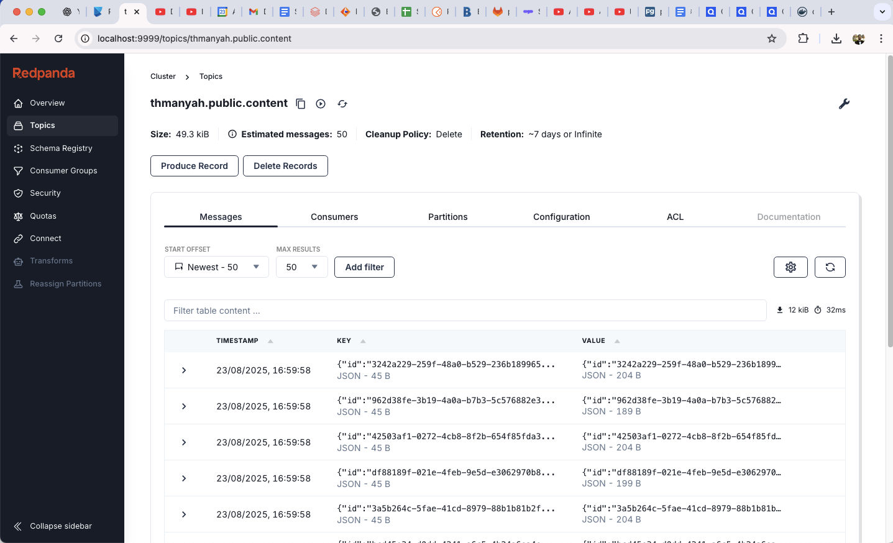
#### Kafka Consumer: `thmanyah-streaming-application` 
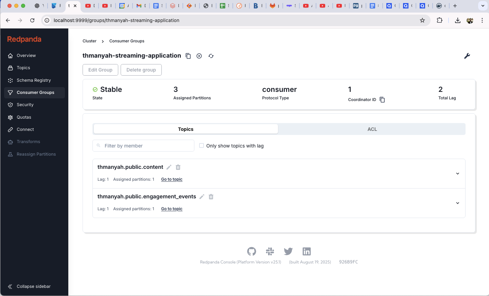

---

### PgAdmin Thmanyah Database 
#### Table: `content` 
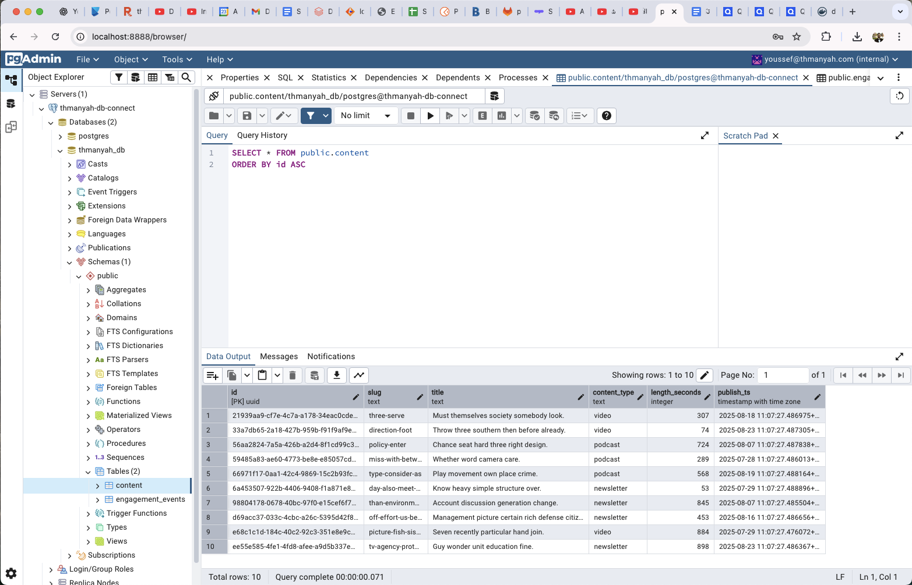
#### Table: `engagement_events` 
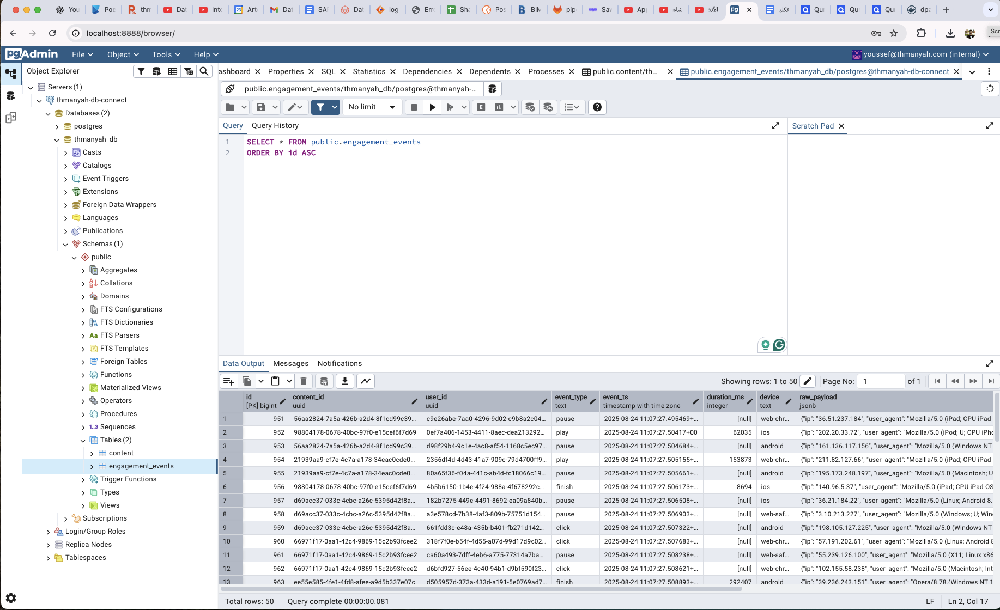

--- 

### RedisInsight 
#### Sorted Set: `engagement_scores` 
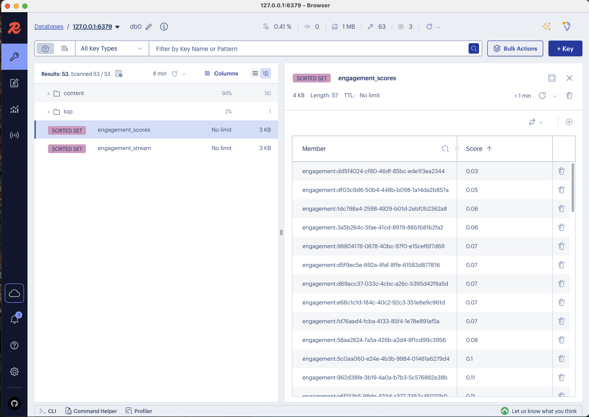
#### Sorted Set: `engagement_stream` 
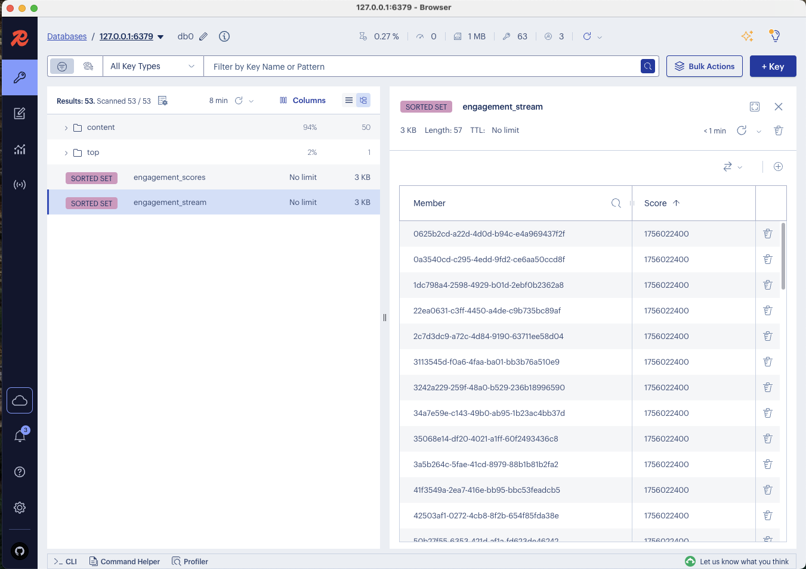
#### Hash: `last_10_minutes` 
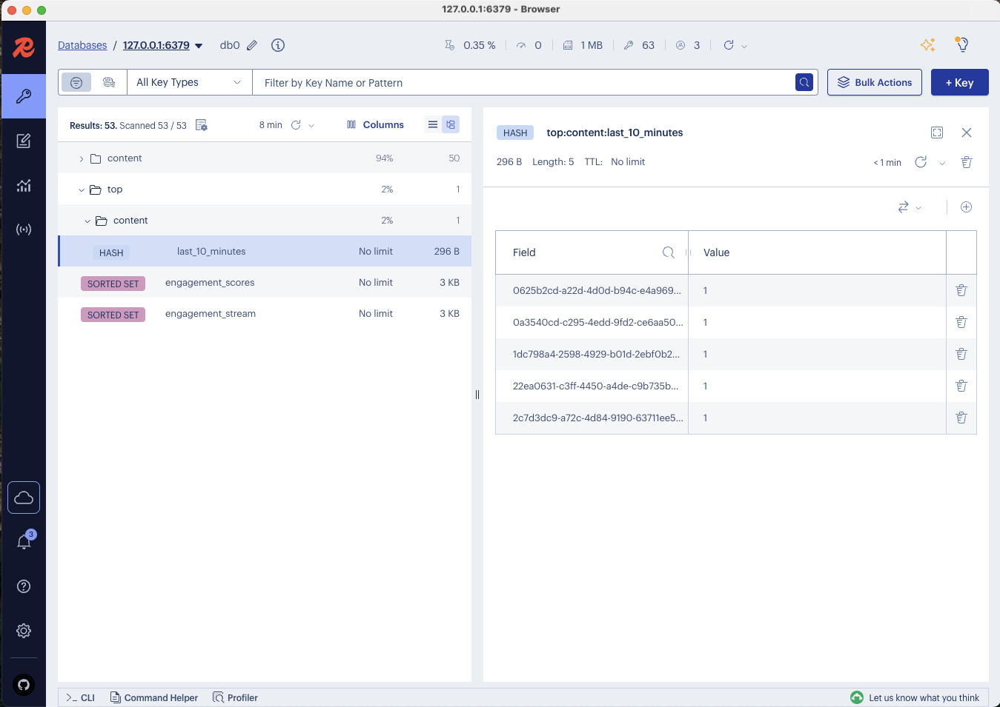

--- 

### BigQuery Console 
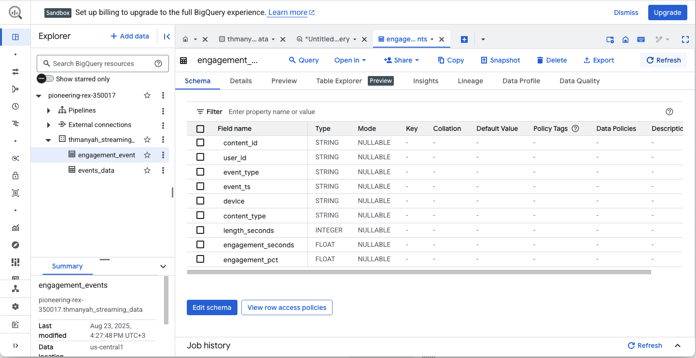

--- 

### Faust Live Streaming (Less than 5 Sec)
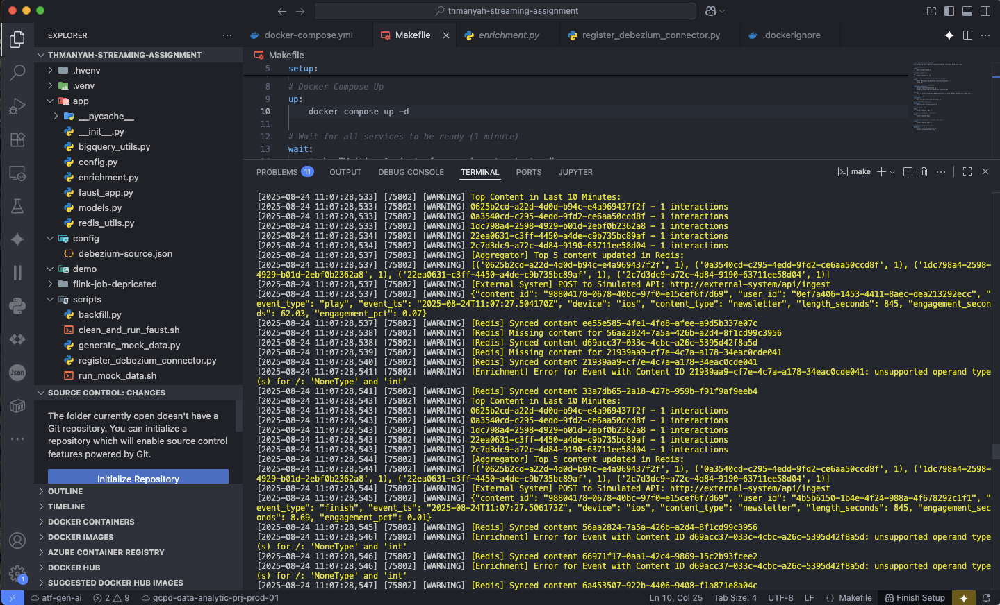

---

## Author

**Youssef El-Mahdy**  
Senior Data Engineer  
[LinkedIn](https://www.linkedin.com/in/youssef-elmahdy)

